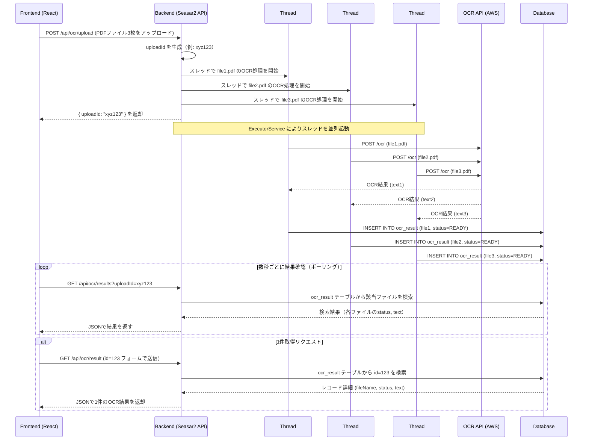

### シーケンス


### Action

```Java
package your.package.web.api;

import java.util.List;
import javax.annotation.Resource;
import javax.servlet.http.HttpServletRequest;

import org.seasar.struts.annotation.Execute;
import org.seasar.framework.beans.util.Beans;
import org.apache.commons.fileupload.FileItem;
import org.apache.struts.upload.FormFile;

import your.package.dto.OcrResultDto;
import your.package.service.OcrService;
import your.package.form.OcrUploadForm;

public class OcrAction {

    @Resource
    private OcrService ocrService;

    public OcrUploadForm ocrUploadForm;

    @Execute(validator = false)
    public String upload() {
        String uploadId = UUID.randomUUID().toString(); // リクエストをグルーピングするための一意のid
        List<Integer> recordIds = ocrService.handleUpload(uploadId, ocrUploadForm.files);

        Map<String, Object> response = new HashMap<>();
        response.put("uploadId", uploadId);
        response.put("recordIds", recordIds);
        return toJson(response);
    }

    @Execute(validator = false)
    public String results() {
        String uploadId = ocrUploadForm.uploadId;
        List<OcrResultDto> results = ocrService.getResults(uploadId);
        return toJson(results);  // Jacksonなどを使ってJSONに変換
    }

    @Execute(validator = false)
    public String result() {
        String idStr = ocrResultForm.id;
        if (idStr == null || idStr.isEmpty()) {
            リクエストで何もなかったら、400返す
            return toJson(Collections.singletonMap("error", "id is required"));
        }

        try {
            int id = Integer.parseInt(idStr);
            OcrResultDto dto = ocrService.getResult(id);
            if (dto == null) {
                return toJson(Collections.singletonMap("error", "Not found"));
            }
            return toJson(dto);
        } catch (NumberFormatException e) {
            return toJson(Collections.singletonMap("error", "Invalid id format"));
        }
    }


    private String toJson(Object obj) {
        try {
            return new com.fasterxml.jackson.databind.ObjectMapper().writeValueAsString(obj);
        } catch (Exception e) {
            throw new RuntimeException(e);
        }
    }
}
```

### Form

```Java
package your.package.form;

import java.util.List;
import org.apache.struts.upload.FormFile;

public class OcrUploadForm {
    public List<FormFile> files;
    public String id;
    public String uploadId;
}
```

### Service

```Java
package your.package.service;

import java.util.*;
import java.util.concurrent.*;
import java.util.stream.Collectors;

import javax.annotation.Resource;
import org.apache.commons.io.IOUtils;

import your.package.dao.OcrResultDao;
import your.package.dto.OcrResultDto;
import your.package.entity.OcrResult;

public class OcrService {

    @Resource
    public OcrResultDao ocrResultDao;

    private ExecutorService executor = Executors.newFixedThreadPool(3); // スレッド数を3に

    public List<Integer> handleUpload(String uploadId, List<FormFile> files) {
        List<Integer> recordIds = new ArrayList<>();

        for (FormFile file : files) {
            // まずDBに空のレコードをinsertしてidを取得
            OcrResult result = new OcrResult();
            result.uploadId = uploadId;
            result.fileName = file.getFileName();
            result.status = "PROCESSING";
            result.createdAt = new Date();

            int insertedId = ocrResultDao.insert(result);  // insertでDBの主キーIDが返る想定
            recordIds.add(insertedId);

            byte[] fileBytes = IOUtils.toByteArray(file.getInputStream());
            // 非同期処理
            executor.submit(() -> {
                try {
                    String text = callOcrApi(fileBytes);

                    // update処理（insert時のIDでレコード特定）
                    OcrResult updateResult = new OcrResult();
                    updateResult.id = insertedId;
                    updateResult.text = text;
                    updateResult.status = "READY";
                    ocrResultDao.update(updateResult);

                } catch (Exception e) {
                    OcrResult failResult = new OcrResult();
                    failResult.id = insertedId;
                    failResult.text = "";
                    failResult.status = "FAILED";
                    ocrResultDao.update(failResult);
                }
            });
        }
        return recordIds;
    }


    public List<OcrResultDto> getResults(String uploadId) {
        List<OcrResult> entities = ocrResultDao.findByUploadId(uploadId);
        return entities.stream().map(e -> {
            OcrResultDto dto = new OcrResultDto();
            dto.fileName = e.fileName;
            dto.status = e.status;
            dto.text = e.text;
            return dto;
        }).collect(Collectors.toList());
    }

    public OcrResultDto getResult(int id) {
        OcrResult entity = ocrResultDao.findById(id);
        if (entity == null) return null;

        OcrResultDto dto = new OcrResultDto();
        dto.fileName = entity.fileName;
        dto.status = entity.status;
        dto.text = entity.text;
        return dto;
    }


    private String callOcrApi(byte[] fileBytes) {
        // OCR API へのHTTPリクエスト処理（例: OkHttp や Apache HttpClient）
        // ダミー実装
        return "OCR結果のダミー";
    }
}
```

### dto

```Java
package your.package.dto;

public class OcrResultDto {
    public String fileName;
    public String status;
    public String text;
}
```

### entity & dao

```Java
package your.package.entity;

import java.util.Date;

public class OcrResult {
    public Integer id;
    public String uploadId;
    public String fileName;
    public String text;
    public String status;
    public Date createdAt;
}
```

```Java
package your.package.dao;

import java.util.List;
import your.package.entity.OcrResult;

public interface OcrResultDao {
    List<OcrResult> findByUploadId(String uploadId);
    int insert(OcrResult entity);
    int update(OcrResult entity);
    OcrResult findById(int id);
}
```