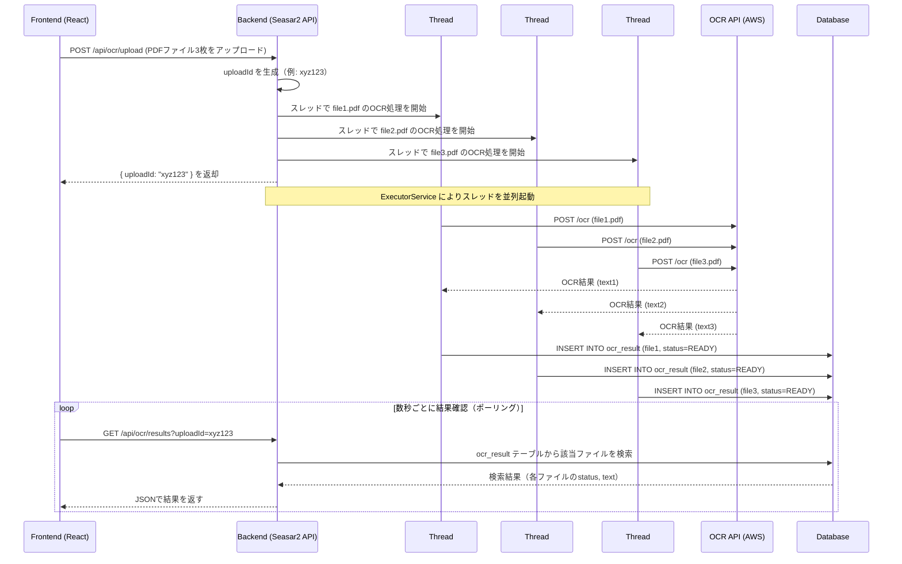

### シーケンス


### Action

```Java
package your.package.web.api;

import java.util.List;
import javax.annotation.Resource;
import javax.servlet.http.HttpServletRequest;

import org.seasar.struts.annotation.Execute;
import org.seasar.framework.beans.util.Beans;
import org.apache.commons.fileupload.FileItem;
import org.apache.struts.upload.FormFile;

import your.package.dto.OcrResultDto;
import your.package.service.OcrService;
import your.package.form.OcrUploadForm;

public class OcrAction {

    @Resource
    public OcrService ocrService;

    public OcrUploadForm ocrUploadForm;

    @Execute(validator = false)
    public String upload() {
        String uploadId = ocrService.handleUpload(ocrUploadForm.files);
        // JSONで返す
        return "{\"uploadId\": \"" + uploadId + "\"}";
    }

    @Execute(validator = false)
    public String results() {
        String uploadId = ocrUploadForm.uploadId;
        List<OcrResultDto> results = ocrService.getResults(uploadId);
        return toJson(results);  // Jacksonなどを使ってJSONに変換
    }

    private String toJson(Object obj) {
        // 例: ObjectMapper を使ってJSONに変換
        try {
            return new com.fasterxml.jackson.databind.ObjectMapper().writeValueAsString(obj);
        } catch (Exception e) {
            throw new RuntimeException(e);
        }
    }
}
```

### Form

```Java
package your.package.form;

import java.util.List;
import org.apache.struts.upload.FormFile;

public class OcrUploadForm {
    public List<FormFile> files;
    public String uploadId;
}
```

### Service

```Java
package your.package.service;

import java.util.*;
import java.util.concurrent.*;
import java.util.stream.Collectors;

import javax.annotation.Resource;
import org.apache.commons.io.IOUtils;

import your.package.dao.OcrResultDao;
import your.package.dto.OcrResultDto;
import your.package.entity.OcrResult;

public class OcrService {

    @Resource
    public OcrResultDao ocrResultDao;

    private ExecutorService executor = Executors.newFixedThreadPool(3);

    public String handleUpload(List<FormFile> files) {
        String uploadId = UUID.randomUUID().toString();

        for (FormFile file : files) {
            executor.submit(() -> {
                try {
                    byte[] fileBytes = IOUtils.toByteArray(file.getInputStream());

                    // OCRリクエスト送信
                    String text = callOcrApi(fileBytes);

                    // 結果を保存
                    OcrResult result = new OcrResult();
                    result.uploadId = uploadId;
                    result.fileName = file.getFileName();
                    result.text = text;
                    result.status = "READY";
                    result.createdAt = new Date();
                    ocrResultDao.insert(result);
                } catch (Exception e) {
                    // エラー処理（status=FAILED で保存）
                    OcrResult result = new OcrResult();
                    result.uploadId = uploadId;
                    result.fileName = file.getFileName();
                    result.text = "";
                    result.status = "FAILED";
                    result.createdAt = new Date();
                    ocrResultDao.insert(result);
                }
            });
        }

        return uploadId;
    }

    public List<OcrResultDto> getResults(String uploadId) {
        List<OcrResult> entities = ocrResultDao.findByUploadId(uploadId);
        return entities.stream().map(e -> {
            OcrResultDto dto = new OcrResultDto();
            dto.fileName = e.fileName;
            dto.status = e.status;
            dto.text = e.text;
            return dto;
        }).collect(Collectors.toList());
    }

    private String callOcrApi(byte[] fileBytes) {
        // OCR API へのHTTPリクエスト処理（例: OkHttp や Apache HttpClient）
        // ダミー実装
        return "OCR結果のダミー";
    }
}
```

### dto

```Java
package your.package.dto;

public class OcrResultDto {
    public String fileName;
    public String status;
    public String text;
}
```

### entity & dao

```Java
package your.package.entity;

import java.util.Date;

public class OcrResult {
    public String uploadId;
    public String fileName;
    public String text;
    public String status;
    public Date createdAt;
}
```

```Java
package your.package.dao;

import java.util.List;
import your.package.entity.OcrResult;

public interface OcrResultDao {
    List<OcrResult> findByUploadId(String uploadId);
    int insert(OcrResult entity);
}
```